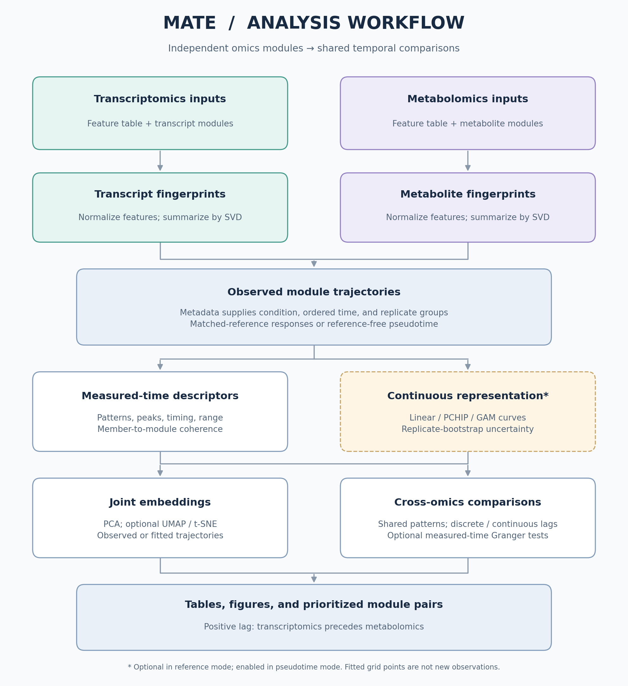

# MATE 3.0

**MATE - Multi-omics Feature Analysis through Trajectory Embeddings**

A treatment-aware, reference-aware and lag-aware framework for integrating **time-resolved transcriptomics and metabolomics** through module-level temporal trajectories rather than relying only on pooled cross-omics correlation.

---

## Overview

Multi-omics time-series experiments often measure transcriptional and metabolic responses at the same nominal time points, but the two molecular layers do not necessarily respond at the same rate. Transcriptional regulation can precede metabolite accumulation, and the same pathway can show an early response under one treatment and a delayed response under another. If samples are pooled across conditions or compared only by contemporaneous correlation, these temporal relationships can be weakened, missed or misinterpreted.

MATE was developed to address this problem.

Instead of immediately correlating every transcript with every metabolite, MATE:

1. builds transcriptomic and metabolomic modules independently;
2. summarizes each module using an SVD-derived **metafingerprint**;
3. represents the response of each module across time;
4. compares treatments with their matched reference/mock samples when such a reference exists;
5. derives trajectory descriptors such as direction, peak timing, dynamic range and response timing;
6. embeds transcript and metabolite trajectories in a common low-dimensional space; and
7. evaluates synchronous and lagged transcript–metabolite relationships.

The central idea is that **temporal behavior is itself an informative multi-omics feature**.

MATE therefore asks:

> Do independently derived transcriptomic and metabolomic modules show compatible temporal responses, and does allowing a biologically plausible delay improve their agreement?

---

## Why MATE?

Many multi-omics integration workflows use correlation as the principal measure of association. Correlation is useful, but it can become problematic in time-resolved experiments.

Consider a biosynthetic pathway in which:

- pathway genes are induced at 12 h,
- enzyme activity increases afterward,
- the corresponding metabolite accumulates at 24–48 h.

A gene and metabolite may be biologically linked even if their values at identical time points are only weakly correlated.

A second problem arises when multiple treatments are pooled. For example:

- Treatment A may induce an early response,
- Treatment B may induce an intermediate response,
- Treatment C may induce a late response.

Pooling these measurements by time can flatten or obscure all three responses.

MATE preserves the **treatment × time** structure and explicitly evaluates temporal displacement between omics layers.

---

# Conceptual workflow



The diagram source is [docs/render_workflow.py](docs/render_workflow.py).
Regenerate it with `python docs/render_workflow.py`.

```text
Transcriptomics                         Metabolomics
      |                                      |
      v                                      v
Co-expression modules                 Co-abundance modules
      |                                      |
      v                                      v
SVD metafingerprints                  SVD metafingerprints
      |                                      |
      +------------------+-------------------+
                         |
                         v
          Treatment/reference response
                         |
                         v
                Temporal trajectories
                         |
        +----------------+----------------+
        |                                 |
        v                                 v
Trajectory descriptors              Continuous trajectory
Pattern / peak / AUC /              representation
dynamic range / timing              where appropriate
        |                                 |
        +----------------+----------------+
                         |
                         v
                Joint trajectory space
              PCA / UMAP / t-SNE
                         |
                         v
               Cross-omics comparison
                         |
                         v
          synchronous + lag-aware pairs
```

A key design principle is that the original transcript and metabolite modules are generated **independently**. Cross-omics integration takes place only after module-level temporal representations have been derived.

This reduces circularity: a transcript and metabolite are not placed together simply because they were correlated beforehand.

---

# Input data

## 1. Transcriptomics quantitative table

Recommended structure:

```text
feature,S01,S02,S03,S04,S05,...
Solyc01g000010,12.1,11.8,13.4,18.5,17.9,...
Solyc01g000020,4.2,4.8,4.1,8.6,8.1,...
...
```

Requirements:

- one row per feature/gene;
- one column per sample;
- feature IDs must match module member IDs in the transcriptomics module database;
- quantitative values must be numeric;
- sample names must match the metadata.

The matrix should already have undergone the normalization appropriate to the upstream transcriptomics analysis.

MATE is not intended to replace RNA-seq count normalization or differential-expression analysis.

---

## 2. Metabolomics quantitative table

Recommended structure:

```text
feature,S01,S02,S03,S04,S05,...
M243T2033,10231,10980,9830,32611,34120,...
M279T2328,2811,3022,2901,7114,7422,...
...
```

Requirements are analogous to the transcriptomics table.

Feature IDs may be:

- annotated metabolite names;
- LC–MS feature IDs;
- m/z-retention-time identifiers;
- other unique identifiers,

provided that they are consistent between the quantitative table and the metabolite module definitions.

MATE does not perform chromatographic peak detection, adduct grouping or metabolite annotation.

---

## 3. Metadata

A minimal metadata table should contain:

```text
sample,condition,time,replicate
CF_12_R1,C_fulvum,12,1
CF_12_R2,C_fulvum,12,2
CF_24_R1,C_fulvum,24,1
CF_24_R2,C_fulvum,24,2
Mock_12_R1,Mock,12,1
Mock_12_R2,Mock,12,2
...
```

Recommended fields:

| Column | Description |
|---|---|
| `sample` | Sample ID matching the quantitative matrices |
| `condition` | Treatment / biological condition |
| `time` | Ordered time value |
| `replicate` | Biological replicate |
| reference indicator | Optional explicit control/reference mapping where needed |

The same experimental sample does not have to exist in both omics matrices if the implementation supports modality-specific sample matching, but the time and condition structure must be comparable.

---

## 4. Module databases

MATE can use SQLite databases containing transcriptomic and metabolomic module definitions.

The original MEANtools-derived database structure uses cluster tables with module membership stored in fields such as:

```text
Cluster
Members
```

and decay-rate-specific tables such as:

```text
clone_DR_25
```

Table names must contain `clone` (case-insensitive), matching the original
MEANtools importer. The decay rate can be selected at run time; `-dr 25` selects
tables whose names contain `DR_25` when that decay rate is present.

Module membership strings should resolve to feature IDs present in the corresponding quantitative table.

---

# Recommended command-line interface

Run MATE from the repository root with explicit omics-specific arguments:

```bash
python -m mate \
  --transcriptomics_table fungal_TR_expression.csv \
  --metabolomics_table fungal_MS_abundance.csv \
  --transcriptomics_db tomato_fungal_coexp.sqlite \
  --metabolomics_db tomato_fungal_coabun.sqlite \
  --metadata new_fungal_pheno.txt \
  --trajectory_mode reference --reference_condition Mock \
  --n_timepoints 3 --time_values "12,24,48" \
  --embedding_method both --stratify_by condition \
  --trajectory_metric effect_size --effect_size_threshold 0.5 \
  -dr 25 -o MATE
```

Replace `Mock` with the reference condition in your metadata. For reference-free
ordered trajectories, use `--trajectory_mode pseudotime` and omit
`--reference_condition`. List all options with:

```bash
python -m mate --help
```

The script entry point is `python MATE_v3_0.py`, with the same analysis arguments
and output filenames as `python -m mate`. After installation, `mate` is also
available as a command. Check the version with `python -m mate --version`.

See [example commands](docs/example_commands.md) for Conda setup, reference and
pseudotime analyses, continuous trajectories, and output-directory handling.

## Try the bundled example

The [falcarindiol example directory](examples/falcarindiol/README.md) contains
synthetic feature tables, metadata, module definitions, and a runnable example.
From the repository root:

```bash
python -m pip install -r requirements.txt
python examples/falcarindiol/run_example.py
```

The runner creates SQLite module databases and writes results to
`examples/falcarindiol/results/`. Add `--continuous` to include continuous
trajectory fitting. These are demonstration data, not experimental falcarindiol
measurements.

---

# Important options

The following options summarize the principal controls used across the current MATE development series.

## Core inputs

```text
--transcriptomics_table
--metabolomics_table
--transcriptomics_db
--metabolomics_db
--metadata
```

## Time structure

```text
--n_timepoints
--time_values
--time_column
```

Example:

```bash
--n_timepoints 3 --time_values "12,24,48"
```

## Treatment-aware trajectories

```text
--stratify_by condition
--trajectory_metric effect_size
--effect_size_threshold 0.5
```

## Module/network selection

```text
-dr 25
```

## Embedding

```text
--embedding_method none
--embedding_method umap
--embedding_method tsne
--embedding_method both
```

Common embedding controls in development versions include:

```text
--embedding_metric
--tsne_perplexity
--umap_neighbors
--umap_min_dist
--embedding_color_by
```

## Output

```text
-o MATE
```

sets the output prefix.

---

# Example: tomato pathogen-response dataset

A representative MATE analysis used transcriptomics and metabolomics from tomato leaves exposed to microbial elicitors at:

```text
12 h
24 h
48 h
```

The analysis contained conditions including:

```text
Cladosporium fulvum
Malassezia restricta
chitin
mock/reference samples
```

A representative command is:

```bash
python -m mate \
  --transcriptomics_table fungal_TR_expression.csv \
  --metabolomics_table fungal_MS_abundance.csv \
  --transcriptomics_db tomato_fungal_coexp.sqlite \
  --metabolomics_db tomato_fungal_coabun.sqlite \
  --metadata new_fungal_pheno.txt \
  --trajectory_mode reference --reference_condition Mock \
  --n_timepoints 3 --time_values "12,24,48" \
  --embedding_method both --stratify_by condition \
  --trajectory_metric effect_size --effect_size_threshold 0.5 \
  -dr 25 -o MATE
```
---

# Output files

See [docs/output_columns.md](docs/output_columns.md) for the current v3.0 column
definitions, units, mode-specific behavior, and lag sign convention.

Output names vary slightly between development versions. Typical MATE outputs include the following classes of files.

## Module fingerprints

```text
*_global_fingerprints_all_samples.csv
*_transcriptomics_fingerprints.csv
*_metabolomics_fingerprints.csv
```

These contain module-level SVD representations and member statistics.

Typical columns:

```text
ID
Members
n_features_found
n_features_missing
<sample-level fingerprint values>
```

---

## Trajectory descriptors

```text
*_trajectory_descriptors.csv
*_transcriptomics_trajectory_descriptors.csv
*_metabolomics_trajectory_descriptors.csv
```

Typical fields include:

```text
ID
condition
T1_<time>
T2_<time>
T3_<time>
Pattern
ResponseStatePattern
Peak
AbsPeak
DynamicRange
Variance
AUC
ResponseTiming
```

---

## Joint embeddings

Typical outputs include coordinate tables and image files for:

```text
PCA
UMAP
t-SNE
```

Depending on configuration, plots may be colored by:

```text
Pattern
ResponseStatePattern
Peak
AbsPeak
ResponseTiming
condition
modality
```

A combined embedding is generally more informative for MATE than separate transcript-only and metabolite-only plots because the goal is to examine whether the two independently derived omics representations occupy compatible temporal space.

---

## Lag-aware cross-omics pairs

A principal output is typically:

```text
MATE_cross_omics_lag_top_pairs.csv
```

or an equivalent prefix-specific filename.

Typical columns include:

```text
Condition
TranscriptModule
MetaboliteModule
Lag0Similarity
BestLagSteps
BestLagTimeMedian
BestLagSimilarity
BestLagRMSE
SimilarityGain
RelationshipType
```

Additional trajectory and coherence information may also be included.

---

# Experimental design recommendations

MATE performs best when the experimental design contains:

- at least three biologically meaningful time points;
- biological replication;
- matched treatment/reference samples where treatment-response inference is desired;
- comparable time coverage for transcriptomics and metabolomics;
- modules containing enough measured members to estimate a stable fingerprint.

### Three time points

Good for:

- early / intermediate / late response;
- coarse trajectory shape;
- one-step lag hypotheses;
- treatment-aware trajectory embedding.

Use caution with:

- nonlinear curve fitting;
- sub-interval lag estimates;
- causal inference.

### Five or more time points

Better suited to:

- continuous trajectory modelling;
- smoother lag estimation;
- nonlinear response patterns;
- peak/inflexion timing;
- pseudo-time or developmental trajectory analysis.

More time points do not compensate for poor replication or batch-confounded design.

---

# What MATE does not claim

MATE intentionally separates temporal association from causal or biochemical proof.

MATE does **not** by itself establish:

- direct enzyme–substrate relationships;
- reaction direction;
- physical interaction;
- transcriptional causality;
- metabolite identity;
- pathway membership;
- regulatory causation.

A strong MATE pair is a **prioritized hypothesis**.

The hypothesis becomes much stronger when supported by orthogonal evidence such as:

- enzyme annotation;
- genomic clustering;
- knockout/CRISPR phenotypes;
- isotope tracing;
- MS/MS;
- authentic standards;
- spatial co-localization;
- biochemical assays;
- pathway databases.

---

# MATE versus conventional cross-omics correlation

| Conventional correlation | MATE |
|---|---|
| compares feature abundance directly | compares module-level temporal representations |
| often evaluates same-time measurements | explicitly evaluates lagged relationships |
| can pool treatments | preserves treatment-specific responses |
| sensitive to delayed metabolite accumulation | designed to detect temporal displacement |
| feature-centric | module/trajectory-centric |
| association often represented by one coefficient | integrates trajectory shape, timing, lag, error and coherence |
| correlation is the primary integration step | cross-omics integration occurs after independent module summarization |

MATE can still use similarity or correlation-like metrics during trajectory comparison. The distinction is that these are applied **after temporal structure has been represented**, rather than being the starting point for module discovery.

---

# Recommended analysis strategy

For a new dataset:

```text
1. Perform modality-specific QC and normalization.
2. Generate transcript co-expression modules.
3. Generate metabolite co-abundance modules.
4. Prepare metadata with sample, condition and time.
5. Run MATE in treatment-aware mode when matched references exist.
6. Inspect response-state and temporal trajectory patterns.
7. Examine the combined PCA/UMAP.
8. Inspect synchronous and lag-aware transcript–metabolite pairs.
9. Rank relationships using multiple MATE metrics.
10. Add biological evidence: annotation, pathways, MS/MS, genetics, etc.
```

Do not begin by selecting only transcript–metabolite pairs that already show strong direct correlation if the goal is to discover delayed relationships. That would remove one of the main advantages of MATE.

---

# Troubleshooting

## Sample names do not match

**Symptom**

```text
metadata samples not present in feature table
```

**Check**

- whitespace in sample names;
- different separators;
- renamed replicates;
- transcriptomics/metabolomics sample suffixes;
- capitalization.

---

## Modules contain many missing members

Check that the feature identifiers in the SQLite module database use the same identifier system as the quantitative table.

For genes, common problems include:

```text
gene vs transcript identifiers
versioned vs unversioned IDs
old vs new genome annotations
```

For metabolomics, confirm that feature IDs have not changed during peak-table filtering.

---

## UMAP fails or looks unstable

With a small number of modules, reduce:

```text
--umap_neighbors
```

UMAP is stochastic. Use trajectory tables and quantitative lag metrics for interpretation rather than treating exact visual distances as fixed biological quantities.

---

## t-SNE perplexity error

Perplexity must be compatible with the number of observations.

Reduce:

```text
--tsne_perplexity
```

for small module sets.

---

## A biologically expected module has an unexpected `Pattern`

Remember that `Pattern` describes the direction of change **between response values**.

Inspect:

```text
ResponseStatePattern
time-specific response values
Delta_T1_to_T2
Delta_T2_to_T3
```

before interpreting the label biologically.

---

## `Metabolomics_leads` appears inconsistent with the plotted pair

Always verify that:

- the plotted pair corresponds to the same row of the lag table;
- the same condition is shown;
- the same standardized trajectory representation was used;
- the sign convention matches the version of MATE being run.

In the current convention:

```text
positive lag -> transcriptomics leads
negative lag -> metabolomics leads
zero         -> synchronous
```

---

# Reproducibility

For a reproducible MATE analysis, record:

```text
MATE version
Python version
input matrix versions
module database versions
metadata file
decay rate
time points
reference/control definition
trajectory metric
effect-size threshold
embedding parameters
lag search range
random seeds, where applicable
```

Version-controlling the command used for each run is strongly recommended.

---

# Software environment

MATE is implemented as a Python package. From the repository root, create an
environment and install it in editable mode so changes to the source take effect
immediately:

```bash
conda env create -f environment.yml
conda activate mate
python -m mate --help
```

This installs Python 3.11, MATE, the optional analysis dependencies, and pytest.
See [environment.yml](environment.yml) and the
[installation commands](docs/example_commands.md#install-with-conda).

For analysis without development tools, the requirements-file installation is:

```bash
python -m pip install -r requirements.txt
```

Run it from the repository root. `requirements.txt` installs the local package
in editable mode with its `umap` and `stats` extras; dependency definitions stay
in `pyproject.toml`. It is an installation convenience, not a pinned environment
lockfile.

Core dependencies are declared in `pyproject.toml`. Optional extras are:

- `umap`: UMAP embeddings (enabled by the default `--embedding_method umap`).
- `stats`: GAM fitting and Granger tests. Automatic continuous fitting selects
  GAM at five or more measured time points by default, so install this extra
  for those runs or select `--trajectory_model linear` or `pchip`.
- `dev`: the pytest test runner.

For a minimal installation, use `python -m pip install -e .` and choose
`--embedding_method none` or `tsne`. The SQLite reader lives in `mate/io.py` and
does not require `gizmos.py`, RDKit, or NetworkX. The original `gizmos.py` remains
available for separate MEANtools workflows.

---

# Repository structure

```text
MATE/
├── MATE_v3_0.py          # Script launcher and function exports
├── mate/
│   ├── __init__.py      # Package version
│   ├── __main__.py      # python -m mate
│   ├── cli.py           # Arguments and command entry point
│   ├── pipeline.py      # Workflow orchestration and output writing
│   ├── io.py            # Feature tables, metadata, SQLite modules
│   ├── fingerprints.py  # SVD module fingerprints
│   ├── trajectories.py  # Observed reference/pseudotime trajectories
│   ├── continuous.py    # Curve fitting and bootstrap uncertainty
│   ├── integration.py   # Member coherence and shared patterns
│   ├── embeddings.py    # PCA, t-SNE, UMAP
│   ├── clustering.py    # Clustering of PCA coordinates
│   ├── lag.py           # Discrete and continuous lag comparisons
│   ├── statistics.py    # PERMANOVA and Granger tests
│   ├── plotting.py      # Figures and diagnostic plots
│   └── utils.py         # Small shared helpers
├── gizmos.py            # Legacy MEANtools utilities
├── README.md
├── LICENSE              # MIT license
├── THIRD_PARTY_NOTICES.md # Attribution for MEANtools-derived utilities
├── CITATION.cff         # Software citation metadata
├── environment.yml      # Conda environment including analysis/test dependencies
├── MANIFEST.in          # Supporting files included in source distributions
├── pyproject.toml       # Dependencies, installation, command entry point
├── requirements.txt     # Install package plus optional analysis dependencies
├── examples/
│   └── falcarindiol/
│       ├── README.md
│       ├── metadata_example.csv
│       ├── transcriptomics_example.csv
│       ├── metabolomics_example.csv
│       ├── transcriptomics_modules.csv
│       ├── metabolomics_modules.csv
│       └── run_example.py
├── docs/
│   ├── workflow.png
│   ├── render_workflow.py
│   ├── example_commands.md
│   └── output_columns.md
└── tests/
    ├── conftest.py      # Synthetic dual-omics inputs
    ├── test_analysis.py
    ├── test_pipeline.py
    └── data/            # Results captured from the original script
```

For new code, import functions from the module responsible for that analysis:

```python
from mate.fingerprints import calculate_fingerprints_for_matrix
from mate.trajectories import calculate_trajectory_descriptors
from mate.lag import cross_omics_lag_analysis
```

Keep command-line parsing in `cli.py`, workflow decisions in `pipeline.py`, and
scientific calculations in their respective modules. Pass data and options
explicitly between functions. Analysis modules should not import the CLI or the
pipeline. Each module owns its imports, with no wildcard imports or shared global
options. Functions are also available through `MATE_v3_0` for script-based imports.

Run the regression and input-boundary tests with:

```bash
python -m pytest -q
```

The regression tests compare CSV results against the original script for
reference-aware, continuous, and pseudotime workflows, including joint PCA,
bootstrap intervals, module coherence, and lag analysis. They also check generated
plot files and the minimum measured-timepoint requirement for Granger analysis.
See [baseline details](tests/data/README.md).

Release metadata and supporting files are provided in [LICENSE](LICENSE),
[CITATION.cff](CITATION.cff), [environment.yml](environment.yml), and
[example commands](docs/example_commands.md). Source distributions include the
examples, documentation, and regression fixtures through `MANIFEST.in`.

The bundled examples are synthetic. A representative real-data validation
dataset remains a useful addition for future releases.

---

# Relationship to MEANtools

MATE emerged from work on module/metafingerprint analysis in the MEANtools ecosystem but addresses a distinct question.

MEANtools focuses on integration strategies for biosynthetic pathway discovery, including gene–metabolite relationships and pathway hypotheses.

MATE focuses specifically on **time-resolved multi-omics behavior**:

```text
MEANtools-derived modules
        ↓
module metafingerprints
        ↓
temporal trajectories
        ↓
joint embedding
        ↓
lag-aware cross-omics relationships
```

MATE can therefore complement reaction- or correlation-based pathway discovery rather than replacing it.

---

# Current development direction

MATE development is moving from discrete trajectories toward a unified framework supporting both:

### Discrete experimental time series

Examples:

```text
12 h
24 h
48 h
```

with treatment/reference contrasts and coarse lag inference.

### Denser continuous time series

Examples:

```text
0
1
2
4
8
12
24 h
```

with smoother trajectory modelling and more informative temporal alignment.

### Pseudo-time trajectories

Examples:

```text
developmental progression
single-cell pseudo-time
single-organism pseudo-time
```

where trajectory alignment is meaningful but treatment/reference and causal-lag assumptions must be adapted to the biological design.

The long-term goal is to preserve one principle across all modes:

> MATE should represent the experimentally supported trajectory before attempting cross-omics integration.

---

# Citation

Software citation metadata is provided in [CITATION.cff](CITATION.cff):

> Ait abdelouahd, Kawtar, and Vriezen, Wim. MATE: Multi-omics Analysis through
> Trajectory Embeddings. Version 3.0.0. Computer software.
> https://github.com/kumarsaurabh20/MATE

Record the version or commit used in your analysis. A release date and DOI can
be added to `CITATION.cff` when established; a preferred publication citation can
be added when a MATE paper is available.

## License

MATE is distributed under the [MIT License](LICENSE), copyright 2026 Kawtar Ait
abdelouahd and Wim Vriezen. Attribution and the original MIT notice for the
MEANtools-derived utilities are retained in
[THIRD_PARTY_NOTICES.md](THIRD_PARTY_NOTICES.md).

# For new feature requests, contact:

kumarsaurabh.singh@maastrichtuniversity.nl

---

For questions, bug reports or feature requests, please use the repository issue tracker once the public repository is available.
